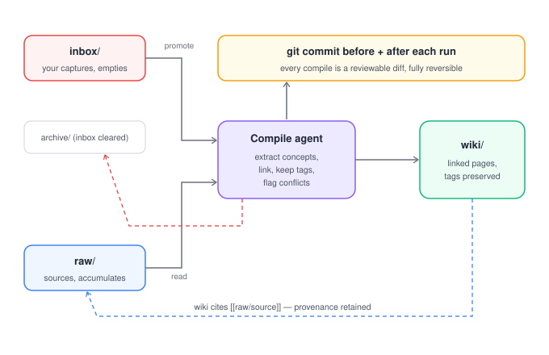

# kb-toolkit

Turn any folder into a self-maintaining, LLM-compiled Obsidian knowledge base — inspired by the "LLM wiki" pattern: **Obsidian is the IDE, the LLM is the programmer, the wiki is the codebase**.

## Privacy model (read this first)

- **Your notes never live in this repo.** kb-toolkit is public scaffolding with **zero notes**.
- **Your vault is a separate git repo** at a path you configure (`vault_path`). It must be **outside** this toolkit directory.
- **Default remote is none** — the vault is local-only and never pushed unless you explicitly add a remote you control.
- **No telemetry, no network calls** from the toolkit except your chosen LLM agent CLI during compile.
- **No Docker for the core tool** — the MCP server and scripts need host access to your vault, `git`, and the `claude` CLI. Claude Desktop launches `kb-mcp` over stdio as a direct subprocess. A future optional networked service (e.g. self-hosted embeddings) could be containerized separately; the core toolkit is not.

## Quickstart

```bash
git clone <your-fork> kb-toolkit && cd kb-toolkit
uv sync
cp kb.config.example.yaml kb.config.yaml
# Edit vault_path to a folder OUTSIDE this repo, e.g. ~/notes
./scripts/setup.sh
./scripts/compile.sh   # when ready (requires claude CLI on PATH)
```

### Claude Desktop (MCP)

See [mcp-server/README.md](mcp-server/README.md) for the exact `claude_desktop_config.json` block using `uv run kb-mcp`.

## Architecture




| Repo | Contains | Remote |
|------|----------|--------|
| **kb-toolkit** | Scripts, prompts, MCP server, config templates | Public git |
| **Your vault** | inbox/, raw/, wiki/, CLAUDE.md, notes | **none** (default) |

## Config reference

Copy [kb.config.example.yaml](kb.config.example.yaml) to `kb.config.yaml`.

| Key | Description |
|-----|-------------|
| `vault_path` | Absolute path to your vault (outside this repo) |
| `folders.*` | Folder names inside the vault |
| `agent.command` | CLI for compile (default `claude`) |
| `agent.model` | Model passed to the agent |
| `compile.schedule` | `manual` or a cron string |
| `compile.never_delete` | Agent must not delete wiki/raw |
| `compile.flag_contradictions` | Use callouts instead of silent overwrite |
| `compile.inbox_after_promotion` | `archive` \| `mark` \| `delete` |
| `git.auto_commit` | Commit vault before/after compile |
| `git.remote` | Default `none` (local-only) |
| `search.provider` | `smart-connections` \| `open-connections` \| `none` |
| `mcp.enabled` | Opt-in flag for Claude Desktop usage |

## What is NOT a dependency (by design)

| Capability | Handled by | Not in Python deps |
|------------|------------|-------------------|
| **LLM inference** (summarize, link, dedupe) | `claude` CLI (or your `agent.command`) during `./scripts/compile.sh` | No LLM SDK |
| **Semantic search** | Smart Connections (or Open Connections) Obsidian plugin | No embeddings library |
| **Heavy NLP** | The compile agent | No NLP stack |

The Python package only provides config validation, vault bootstrap, git commit wrappers, and MCP file tools (lexical search + frontmatter-safe read/write).

## Project layout

```
kb-toolkit/
├── src/kb_toolkit/     # config, notes helpers, MCP server
├── scripts/            # setup.sh, compile.sh, commit-wrapper.sh
├── templates/          # CLAUDE.md.template, vault.gitignore
├── prompts/compile.md  # agent prompt for compile runs
├── mcp-server/         # Claude Desktop registration docs
└── docs/*.svg          # architecture diagrams
```

## Scripts

| Script | Purpose |
|--------|---------|
| `./scripts/setup.sh` | Create vault folders, `git init`, copy CLAUDE.md + .gitignore |
| `./scripts/compile.sh` | Pre-commit → agent → post-commit |
| `./scripts/backfill.sh` | One-time pass over an existing vault to seed `wiki/` from prior notes |
| `./scripts/commit-wrapper.sh` | Git commit helper (respects `git.auto_commit`) |

### Obsidian quality-of-life setup

See [docs/obsidian-button.md](docs/obsidian-button.md) for two optional plugin recipes:

- **One-click compile button** via Shell Commands + Commander (no Terminal).
- **Semantic search** via Smart Connections (local embedding model, no API).

Both are optional; kb-toolkit works end-to-end without them.

## Development

```bash
uv sync
uv run pytest
uv run ruff check src tests
```

## License

Apache-2.0 — see [LICENSE](LICENSE).
